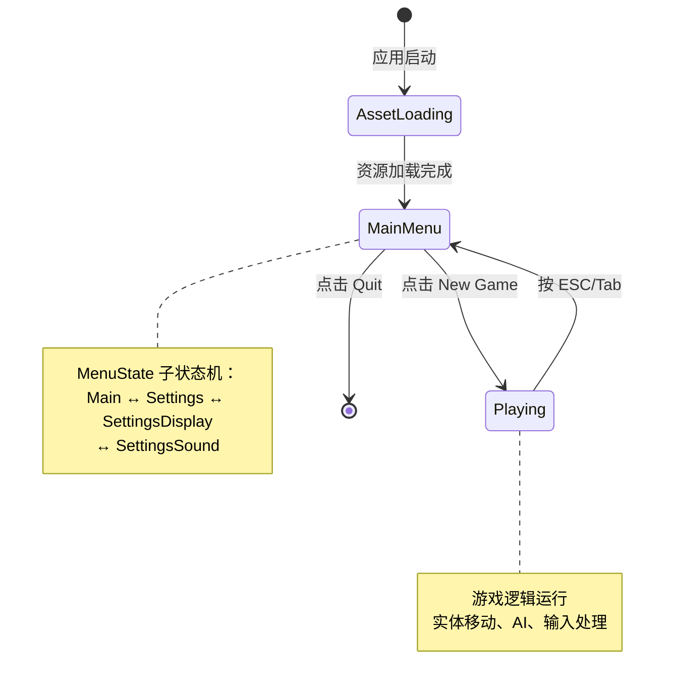

# Vigilant Doodle - 最佳实践架构设计（Bevy 0.17.2）

## 设计原则

### 核心理念
1. **单一职责**：每个插件只负责一个核心功能
2. **状态驱动**：所有行为通过状态转换控制
3. **数据导向**：充分利用 ECS，避免复杂的继承关系
4. **可组合性**：模块间松耦合，易于扩展
5. **性能优先**：利用 Bevy 的并行调度和缓存友好设计

---

## 一、项目结构

```
src/
├── main.rs                      # 应用入口
├── lib.rs                       # 插件注册中心
│
├── core/                        # 核心系统
│   ├── mod.rs
│   ├── state.rs                 # 状态定义
│   └── settings.rs              # 游戏设置（音量、画质等）
│
├── assets/                      # 资源管理
│   ├── mod.rs
│   └── loader.rs                # 统一资源加载
│
├── camera/                      # 相机系统
│   ├── mod.rs
│   ├── isometric.rs             # 斜向俯视相机
│   └── components.rs            # 相机组件定义
│
├── gameplay/                    # 游戏玩法
│   ├── mod.rs
│   ├── player.rs                # 玩家逻辑
│   ├── enemy.rs                 # 敌人 AI
│   ├── movement.rs              # 移动系统
│   └── combat.rs                # 战斗系统（预留）
│
├── world/                       # 世界管理
│   ├── mod.rs
│   ├── terrain.rs               # 地形生成
│   └── spawning.rs              # 实体生成
│
├── ui/                          # UI 系统
│   ├── mod.rs
│   ├── menu/                    # 菜单系统
│   │   ├── mod.rs
│   │   ├── main_menu.rs         # 主菜单
│   │   ├── settings_menu.rs     # 设置菜单
│   │   └── overlay.rs           # 模糊遮罩层
│   ├── hud/                     # 游戏内 HUD
│   │   ├── mod.rs
│   │   ├── health_bar.rs        # 血条
│   │   └── score.rs             # 分数
│   └── styles.rs                # UI 样式常量
│
├── input/                       # 输入管理
│   ├── mod.rs
│   ├── actions.rs               # 输入动作映射
│   └── cursor.rs                # 光标管理
│
└── audio/                       # 音频系统
    ├── mod.rs
    └── manager.rs               # 音频播放器
```

---

## 二、状态机设计

### 1. 核心状态定义

```rust
// src/core/state.rs

use bevy::prelude::*;

/// 游戏主状态
#[derive(States, Default, Clone, Eq, PartialEq, Debug, Hash)]
pub enum GameState {
    #[default]
    AssetLoading,    // 资源加载
    MainMenu,        // 主菜单（游戏场景 + 模糊 + 菜单 UI）
    Playing,         // 游戏进行
    Paused,          // 游戏暂停（可选，与 MainMenu 区分）
}

/// 菜单子状态（仅在 MainMenu 状态下激活）
#[derive(States, Default, Clone, Eq, PartialEq, Debug, Hash)]
pub enum MenuState {
    #[default]
    Disabled,        // 菜单禁用（Playing 状态）
    Main,            // 主菜单界面
    Settings,        // 设置界面
    SettingsDisplay, // 显示设置
    SettingsSound,   // 声音设置
}

/// 状态机插件
pub struct StatePlugin;

impl Plugin for StatePlugin {
    fn build(&self, app: &mut App) {
        app
            .init_state::<GameState>()
            .init_state::<MenuState>()
            // 添加状态转换事件监听（用于日志）
            .add_systems(OnEnter(GameState::AssetLoading), log_enter_loading)
            .add_systems(OnEnter(GameState::MainMenu), log_enter_menu)
            .add_systems(OnEnter(GameState::Playing), log_enter_playing);
    }
}

fn log_enter_loading() {
    info!("[State] → AssetLoading");
}

fn log_enter_menu() {
    info!("[State] → MainMenu");
}

fn log_enter_playing() {
    info!("[State] → Playing");
}
```

### 2. 状态转换流程



---

## 三、相机系统设计

### 1. 斜向俯视相机（Isometric Camera）

```rust
// src/camera/isometric.rs

use bevy::prelude::*;

/// 斜向俯视相机配置
#[derive(Component)]
pub struct IsometricCamera {
    /// 相机距离目标的偏移量（相对坐标）
    pub offset: Vec3,
    /// 跟随速度（数值越大越快，0 = 瞬移）
    pub follow_speed: f32,
    /// 相机俯仰角（弧度）
    pub pitch: f32,
    /// 相机偏航角（弧度）
    pub yaw: f32,
}

impl Default for IsometricCamera {
    fn default() -> Self {
        Self {
            // 默认：后上方 45 度俯视
            offset: Vec3::new(0.0, 12.0, 10.0),
            follow_speed: 5.0,
            pitch: -45.0_f32.to_radians(),
            yaw: 0.0,
        }
    }
}

/// 相机跟随目标标记
#[derive(Component)]
pub struct CameraTarget;

/// 相机插件
pub struct IsometricCameraPlugin;

impl Plugin for IsometricCameraPlugin {
    fn build(&self, app: &mut App) {
        app
            // 在 AssetLoading 阶段生成相机（始终存在）
            .add_systems(OnEnter(GameState::AssetLoading), spawn_camera)
            // 在 Playing 状态下更新相机跟随
            .add_systems(
                Update,
                update_camera_follow
                    .run_if(in_state(GameState::Playing))
            )
            // 在 MainMenu 状态下也更新相机跟随（让背景有动感）
            .add_systems(
                Update,
                update_camera_follow
                    .run_if(in_state(GameState::MainMenu))
            );
    }
}

fn spawn_camera(mut commands: Commands) {
    let camera_config = IsometricCamera::default();

    commands.spawn((
        Camera3d::default(),
        Transform::from_translation(camera_config.offset)
            .looking_at(Vec3::ZERO, Vec3::Y),
        IsometricCamera::default(),
        Name::new("IsometricCamera"),
    ));

    info!("[Camera] Isometric camera spawned at offset {:?}", camera_config.offset);
}

fn update_camera_follow(
    target_query: Query<&Transform, With<CameraTarget>>,
    mut camera_query: Query<
        (&mut Transform, &IsometricCamera),
        (With<Camera3d>, Without<CameraTarget>)
    >,
    time: Res<Time>,
) {
    let Ok(target_transform) = target_query.get_single() else {
        return;
    };

    let Ok((mut camera_transform, camera_config)) = camera_query.get_single_mut() else {
        return;
    };

    // 计算目标位置
    let target_position = target_transform.translation + camera_config.offset;

    // 平滑插值跟随
    camera_transform.translation = camera_transform.translation.lerp(
        target_position,
        camera_config.follow_speed * time.delta_secs()
    );

    // 始终看向目标
    camera_transform.look_at(target_transform.translation, Vec3::Y);
}
```

### 2. 相机参数优化建议

| 参数 | 推荐值 | 说明 |
|------|--------|------|
| `offset.y` | 10.0 - 15.0 | 高度，根据地板大小调整 |
| `offset.z` | 8.0 - 12.0 | 后方距离 |
| `pitch` | -30° ~ -60° | 俯仰角，-45° 最经典 |
| `follow_speed` | 5.0 - 10.0 | 跟随速度，越大越紧 |
| FOV | 60° - 75° | 视野角度，默认 60° |

---

## 四、实体生命周期管理

### 1. 核心原则

**关键设计决策**：
- 所有游戏实体在 `AssetLoading` 状态就创建好
- 初始状态为 `Visibility::Inherited`（默认可见）
- 不使用 show/hide 系统，通过状态控制系统是否运行

### 2. 实体生成流程

```rust
// src/world/spawning.rs

use bevy::prelude::*;

pub struct SpawningPlugin;

impl Plugin for SpawningPlugin {
    fn build(&self, app: &mut App) {
        app
            // 在资源加载完成后立即生成所有实体
            .add_systems(OnEnter(GameState::AssetLoading), (
                spawn_terrain,
                spawn_player,
                spawn_enemies,
            ).chain());
    }
}

fn spawn_terrain(
    mut commands: Commands,
    mut meshes: ResMut<Assets<Mesh>>,
    mut materials: ResMut<Assets<StandardMaterial>>,
) {
    commands.spawn((
        Mesh3d(meshes.add(
            Plane3d::default()
                .mesh()
                .size(50.0, 25.0)
                .build()
        )),
        MeshMaterial3d(materials.add(StandardMaterial {
            base_color: Color::srgb(0.3, 0.3, 0.35),
            ..default()
        })),
        Transform::from_xyz(0.0, -0.5, 0.0),
        Name::new("Floor"),
    ));

    info!("[World] Terrain spawned");
}

fn spawn_player(
    mut commands: Commands,
    assets: Res<AssetServer>,
) {
    commands.spawn((
        SceneRoot(assets.load("model/player.glb#Scene0")),
        Transform::from_xyz(0.0, 0.0, 0.0),
        Player::default(),
        CameraTarget,  // 标记为相机跟随目标
        Name::new("Player"),
    )).with_children(|parent| {
        // 玩家子实体：探照灯
        parent.spawn((
            SpotLight {
                color: Color::srgb(0.8, 1.0, 0.6),
                intensity: 15000.0,
                range: 1000.0,
                outer_angle: 0.7,
                inner_angle: 0.3,
                shadows_enabled: true,
                ..default()
            },
            Transform::from_xyz(0.0, 30.0, 0.0).looking_at(Vec3::ZERO, Vec3::Y),
            Name::new("PlayerFlashlight"),
        ));
    });

    info!("[Player] Player spawned");
}

fn spawn_enemies(
    mut commands: Commands,
    assets: Res<AssetServer>,
) {
    use rand::Rng;
    let mut rng = rand::rng();

    for i in 0..3 {
        let x = rng.random_range(-20.0..20.0);
        let z = rng.random_range(-10.0..10.0);

        commands.spawn((
            SceneRoot(assets.load("model/enemy.glb#Scene0")),
            Transform::from_xyz(x, 0.0, z),
            Enemy::default(),
            Name::new(format!("Enemy_{}", i)),
        ));
    }

    info!("[Enemies] {} enemies spawned", 3);
}
```

### 3. 为什么不用 show/hide？

**传统方案（不推荐）**：
```rust
// ❌ 复杂且性能低
OnEnter(Playing) → 遍历所有实体 → 设置 Visibility::Visible
OnExit(Playing)  → 遍历所有实体 → 设置 Visibility::Hidden
```

**最佳实践（推荐）**：
```rust
// ✅ 简洁且符合 ECS 理念
所有实体始终可见
通过 .run_if(in_state(GameState::Playing)) 控制系统是否执行
```

**优势**：
1. **性能更好**：不需要遍历修改实体
2. **代码更简洁**：减少 50% 的系统数量
3. **符合 Bevy 理念**：状态驱动系统，而非实体驱动
4. **支持菜单背景**：MainMenu 状态时游戏场景可见

---

## 五、UI 系统设计

### 1. 模糊遮罩层（Overlay）

```rust
// src/ui/menu/overlay.rs

use bevy::prelude::*;

/// 菜单遮罩层标记
#[derive(Component)]
pub struct MenuOverlay;

/// 遮罩层插件
pub struct OverlayPlugin;

impl Plugin for OverlayPlugin {
    fn build(&self, app: &mut App) {
        app
            .add_systems(OnEnter(GameState::MainMenu), spawn_overlay)
            .add_systems(OnExit(GameState::MainMenu), despawn_overlay);
    }
}

fn spawn_overlay(mut commands: Commands) {
    commands.spawn((
        Node {
            position_type: PositionType::Absolute,
            width: Val::Percent(100.0),
            height: Val::Percent(100.0),
            left: Val::Px(0.0),
            top: Val::Px(0.0),
            ..default()
        },
        BackgroundColor(Color::srgba(0.0, 0.0, 0.0, 0.6)),  // 60% 不透明黑色
        ZIndex(100),  // 确保在游戏场景之上
        MenuOverlay,
        Name::new("MenuOverlay"),
    ));

    info!("[UI] Menu overlay spawned");
}

fn despawn_overlay(
    mut commands: Commands,
    query: Query<Entity, With<MenuOverlay>>,
) {
    for entity in query.iter() {
        commands.entity(entity).despawn_recursive();
    }

    info!("[UI] Menu overlay despawned");
}
```

### 2. 主菜单 UI

```rust
// src/ui/menu/main_menu.rs

use bevy::prelude::*;

/// 主菜单根节点标记
#[derive(Component)]
pub struct MainMenuRoot;

/// 菜单按钮动作
#[derive(Component, Clone, Copy)]
pub enum MenuAction {
    NewGame,
    Settings,
    Quit,
}

pub struct MainMenuPlugin;

impl Plugin for MainMenuPlugin {
    fn build(&self, app: &mut App) {
        app
            .add_systems(OnEnter(MenuState::Main), setup_main_menu)
            .add_systems(OnExit(MenuState::Main), cleanup_main_menu)
            .add_systems(
                Update,
                (
                    button_visual_feedback,
                    handle_menu_actions,
                ).run_if(in_state(MenuState::Main))
            );
    }
}

fn setup_main_menu(
    mut commands: Commands,
    asset_server: Res<AssetServer>,
) {
    let font = asset_server.load("fonts/FiraSans-Bold.ttf");

    // 主容器（屏幕居中）
    commands.spawn((
        Node {
            position_type: PositionType::Absolute,
            width: Val::Px(400.0),
            height: Val::Auto,
            left: Val::Percent(50.0),
            top: Val::Percent(50.0),
            flex_direction: FlexDirection::Column,
            align_items: AlignItems::Center,
            justify_content: JustifyContent::Center,
            row_gap: Val::Px(20.0),
            padding: UiRect::all(Val::Px(40.0)),
            ..default()
        },
        BackgroundColor(Color::srgba(0.1, 0.1, 0.1, 0.9)),  // 深色半透明背景
        ZIndex(200),  // 在遮罩层之上
        MainMenuRoot,
        Name::new("MainMenuContainer"),
    )).with_children(|parent| {
        // 标题
        parent.spawn((
            Text::new("Vigilant Doodle"),
            TextFont {
                font: font.clone(),
                font_size: 48.0,
                ..default()
            },
            TextColor(Color::WHITE),
            Node {
                margin: UiRect::bottom(Val::Px(30.0)),
                ..default()
            },
        ));

        // 按钮：New Game
        spawn_menu_button(parent, "New Game", MenuAction::NewGame, &font);
        // 按钮：Settings
        spawn_menu_button(parent, "Settings", MenuAction::Settings, &font);
        // 按钮：Quit
        spawn_menu_button(parent, "Quit", MenuAction::Quit, &font);
    });

    info!("[UI] Main menu UI spawned");
}

fn spawn_menu_button(
    parent: &mut ChildBuilder,
    text: &str,
    action: MenuAction,
    font: &Handle<Font>,
) {
    parent.spawn((
        Button,
        Node {
            width: Val::Px(300.0),
            height: Val::Px(60.0),
            justify_content: JustifyContent::Center,
            align_items: AlignItems::Center,
            ..default()
        },
        BackgroundColor(Color::srgb(0.2, 0.2, 0.2)),
        action,
    )).with_children(|parent| {
        parent.spawn((
            Text::new(text),
            TextFont {
                font: font.clone(),
                font_size: 32.0,
                ..default()
            },
            TextColor(Color::WHITE),
        ));
    });
}

fn button_visual_feedback(
    mut query: Query<(&Interaction, &mut BackgroundColor), (Changed<Interaction>, With<Button>)>,
) {
    for (interaction, mut color) in query.iter_mut() {
        *color = match interaction {
            Interaction::Pressed => Color::srgb(0.5, 0.7, 0.5).into(),
            Interaction::Hovered => Color::srgb(0.3, 0.3, 0.3).into(),
            Interaction::None => Color::srgb(0.2, 0.2, 0.2).into(),
        };
    }
}

fn handle_menu_actions(
    query: Query<(&Interaction, &MenuAction), (Changed<Interaction>, With<Button>)>,
    mut game_state: ResMut<NextState<GameState>>,
    mut menu_state: ResMut<NextState<MenuState>>,
    mut exit: MessageWriter<AppExit>,
) {
    for (interaction, action) in query.iter() {
        if *interaction == Interaction::Pressed {
            match action {
                MenuAction::NewGame => {
                    info!("[Menu] Starting new game");
                    game_state.set(GameState::Playing);
                    menu_state.set(MenuState::Disabled);
                }
                MenuAction::Settings => {
                    info!("[Menu] Opening settings");
                    menu_state.set(MenuState::Settings);
                }
                MenuAction::Quit => {
                    info!("[Menu] Quitting game");
                    exit.write(AppExit::Success);
                }
            }
        }
    }
}

fn cleanup_main_menu(
    mut commands: Commands,
    query: Query<Entity, With<MainMenuRoot>>,
) {
    for entity in query.iter() {
        commands.entity(entity).despawn_recursive();
    }
}
```

### 3. UI 层级结构

```
Z-Index 层级（从下到上）：
├─ 0:   3D 游戏场景（Camera3d 渲染）
├─ 100: 模糊遮罩层（MenuOverlay）
├─ 200: 菜单内容（MainMenuRoot）
└─ 300: HUD 元素（血条、分数等）
```

---

## 六、输入管理

### 1. 输入动作映射

```rust
// src/input/actions.rs

use bevy::prelude::*;

/// 输入动作资源
#[derive(Resource, Default)]
pub struct InputActions {
    pub movement: Vec2,
    pub jump: bool,
}

/// 游戏控制键位
pub enum GameControl {
    Forward,
    Backward,
    Left,
    Right,
    Jump,
}

impl GameControl {
    pub fn key(&self) -> KeyCode {
        match self {
            Self::Forward => KeyCode::KeyW,
            Self::Backward => KeyCode::KeyS,
            Self::Left => KeyCode::KeyA,
            Self::Right => KeyCode::KeyD,
            Self::Jump => KeyCode::Space,
        }
    }
}

pub struct InputPlugin;

impl Plugin for InputPlugin {
    fn build(&self, app: &mut App) {
        app
            .init_resource::<InputActions>()
            .add_systems(
                Update,
                process_input
                    .run_if(in_state(GameState::Playing))
            );
    }
}

fn process_input(
    keyboard: Res<ButtonInput<KeyCode>>,
    camera_query: Query<&Transform, With<Camera3d>>,
    mut actions: ResMut<InputActions>,
) {
    let Ok(camera_transform) = camera_query.get_single() else {
        warn!("[Input] Camera not found");
        return;
    };

    let mut direction = Vec2::ZERO;

    // 基于相机方向的移动输入
    if keyboard.pressed(GameControl::Forward.key()) {
        direction.y += 1.0;
    }
    if keyboard.pressed(GameControl::Backward.key()) {
        direction.y -= 1.0;
    }
    if keyboard.pressed(GameControl::Left.key()) {
        direction.x -= 1.0;
    }
    if keyboard.pressed(GameControl::Right.key()) {
        direction.x += 1.0;
    }

    // 归一化（防止斜向移动过快）
    if direction.length() > 0.0 {
        direction = direction.normalize();
    }

    actions.movement = direction;
    actions.jump = keyboard.pressed(GameControl::Jump.key());
}
```

### 2. 光标管理

```rust
// src/input/cursor.rs

use bevy::prelude::*;
use bevy::window::CursorGrabMode;

pub struct CursorPlugin;

impl Plugin for CursorPlugin {
    fn build(&self, app: &mut App) {
        app
            .add_systems(OnEnter(GameState::Playing), lock_cursor)
            .add_systems(OnExit(GameState::Playing), unlock_cursor)
            .add_systems(
                Update,
                handle_escape_key.run_if(in_state(GameState::Playing))
            );
    }
}

fn lock_cursor(mut windows: Query<&mut Window>) {
    let Ok(mut window) = windows.get_single_mut() else { return };

    window.cursor_options.visible = false;
    window.cursor_options.grab_mode = CursorGrabMode::Locked;

    info!("[Cursor] Cursor locked and hidden");
}

fn unlock_cursor(mut windows: Query<&mut Window>) {
    let Ok(mut window) = windows.get_single_mut() else { return };

    window.cursor_options.visible = true;
    window.cursor_options.grab_mode = CursorGrabMode::None;

    info!("[Cursor] Cursor unlocked and visible");
}

fn handle_escape_key(
    keyboard: Res<ButtonInput<KeyCode>>,
    mut game_state: ResMut<NextState<GameState>>,
    mut menu_state: ResMut<NextState<MenuState>>,
) {
    if keyboard.just_pressed(KeyCode::Escape) {
        info!("[Input] ESC pressed, returning to menu");
        game_state.set(GameState::MainMenu);
        menu_state.set(MenuState::Main);
    }
}
```

---

## 七、游戏玩法系统

### 1. 玩家组件

```rust
// src/gameplay/player.rs

use bevy::prelude::*;

#[derive(Component)]
pub struct Player {
    pub speed: f32,
    pub health: f32,
}

impl Default for Player {
    fn default() -> Self {
        Self {
            speed: 10.0,
            health: 100.0,
        }
    }
}

pub struct PlayerPlugin;

impl Plugin for PlayerPlugin {
    fn build(&self, app: &mut App) {
        app.add_systems(
            Update,
            player_movement
                .run_if(in_state(GameState::Playing))
        );
    }
}

fn player_movement(
    mut query: Query<(&mut Transform, &Player)>,
    actions: Res<InputActions>,
    camera_query: Query<&Transform, (With<Camera3d>, Without<Player>)>,
    time: Res<Time>,
) {
    let Ok((mut transform, player)) = query.get_single_mut() else {
        return;
    };

    let Ok(camera_transform) = camera_query.get_single() else {
        return;
    };

    if actions.movement.length() == 0.0 {
        return;
    }

    // 基于相机方向计算移动向量
    let forward = camera_transform.forward();
    let right = camera_transform.right();

    let move_direction =
        (forward.with_y(0.0).normalize() * actions.movement.y) +
        (right.with_y(0.0).normalize() * actions.movement.x);

    // 移动玩家
    transform.translation += move_direction * player.speed * time.delta_secs();

    // 朝向移动方向
    if move_direction.length() > 0.0 {
        transform.look_to(move_direction, Vec3::Y);
    }
}
```

### 2. 敌人 AI

```rust
// src/gameplay/enemy.rs

use bevy::prelude::*;

#[derive(Component)]
pub struct Enemy {
    pub speed: f32,
    pub chase_distance: f32,
    pub stop_distance: f32,
}

impl Default for Enemy {
    fn default() -> Self {
        Self {
            speed: 7.0,
            chase_distance: 20.0,
            stop_distance: 1.5,
        }
    }
}

pub struct EnemyPlugin;

impl Plugin for EnemyPlugin {
    fn build(&self, app: &mut App) {
        app.add_systems(
            Update,
            enemy_chase_player
                .run_if(in_state(GameState::Playing))
        );
    }
}

fn enemy_chase_player(
    player_query: Query<&Transform, With<Player>>,
    mut enemy_query: Query<(&mut Transform, &Enemy), Without<Player>>,
    time: Res<Time>,
) {
    let Ok(player_transform) = player_query.get_single() else {
        return;
    };

    for (mut enemy_transform, enemy) in enemy_query.iter_mut() {
        let to_player = player_transform.translation - enemy_transform.translation;
        let distance = to_player.length();

        // 在追逐距离内且未到达停止距离
        if distance < enemy.chase_distance && distance > enemy.stop_distance {
            let direction = to_player.normalize();
            enemy_transform.translation += direction * enemy.speed * time.delta_secs();
            enemy_transform.look_to(direction, Vec3::Y);
        }
    }
}
```

### 3. 碰撞检测

```rust
// src/gameplay/movement.rs

use bevy::prelude::*;

/// 地形边界常量
pub const FLOOR_HALF_LENGTH: f32 = 24.0;  // 50/2 - 1 (留边距)
pub const FLOOR_HALF_WIDTH: f32 = 11.5;   // 25/2 - 1

pub struct MovementPlugin;

impl Plugin for MovementPlugin {
    fn build(&self, app: &mut App) {
        app.add_systems(
            Update,
            clamp_to_terrain
                .run_if(in_state(GameState::Playing))
                .after(player_movement)  // 在移动之后执行
                .after(enemy_chase_player)
        );
    }
}

fn clamp_to_terrain(
    mut query: Query<&mut Transform, Or<(With<Player>, With<Enemy>)>>,
) {
    for mut transform in query.iter_mut() {
        transform.translation.x = transform.translation.x.clamp(
            -FLOOR_HALF_LENGTH,
            FLOOR_HALF_LENGTH
        );
        transform.translation.z = transform.translation.z.clamp(
            -FLOOR_HALF_WIDTH,
            FLOOR_HALF_WIDTH
        );
    }
}
```

---

## 八、资源加载

### 1. 统一资源管理

```rust
// src/assets/loader.rs

use bevy::prelude::*;
use bevy_asset_loader::prelude::*;
use bevy_kira_audio::AudioSource;

pub struct AssetLoaderPlugin;

impl Plugin for AssetLoaderPlugin {
    fn build(&self, app: &mut App) {
        app.add_loading_state(
            LoadingState::new(GameState::AssetLoading)
                .continue_to_state(GameState::MainMenu)
                .load_collection::<GameAssets>()
        );
    }
}

#[derive(AssetCollection, Resource)]
pub struct GameAssets {
    // 字体
    #[asset(path = "fonts/FiraSans-Bold.ttf")]
    pub font: Handle<Font>,

    // 3D 模型
    #[asset(path = "model/player.glb#Scene0")]
    pub player_model: Handle<Scene>,

    #[asset(path = "model/enemy.glb#Scene0")]
    pub enemy_model: Handle<Scene>,

    // 音频
    #[asset(path = "audio/flying.ogg")]
    pub bgm: Handle<AudioSource>,

    // UI 图标
    #[asset(path = "textures/right.png")]
    pub icon_right: Handle<Image>,

    #[asset(path = "textures/wrench.png")]
    pub icon_settings: Handle<Image>,

    #[asset(path = "textures/exitRight.png")]
    pub icon_exit: Handle<Image>,
}
```

---

## 九、插件注册顺序

### lib.rs 完整结构

```rust
// src/lib.rs

use bevy::prelude::*;

// 模块声明
mod core;
mod assets;
mod camera;
mod gameplay;
mod world;
mod ui;
mod input;
mod audio;

// 导入
use core::state::StatePlugin;
use assets::loader::AssetLoaderPlugin;
use camera::isometric::IsometricCameraPlugin;
use gameplay::{player::PlayerPlugin, enemy::EnemyPlugin, movement::MovementPlugin};
use world::spawning::SpawningPlugin;
use ui::menu::{OverlayPlugin, MainMenuPlugin};
use input::{actions::InputPlugin, cursor::CursorPlugin};
use audio::manager::AudioPlugin;

pub struct GamePlugin;

impl Plugin for GamePlugin {
    fn build(&self, app: &mut App) {
        app
            // 1. 核心系统（状态机）
            .add_plugins(StatePlugin)

            // 2. 资源加载
            .add_plugins(AssetLoaderPlugin)

            // 3. 世界生成（实体生成）
            .add_plugins(SpawningPlugin)

            // 4. 相机系统
            .add_plugins(IsometricCameraPlugin)

            // 5. 输入管理
            .add_plugins((InputPlugin, CursorPlugin))

            // 6. 游戏玩法
            .add_plugins((PlayerPlugin, EnemyPlugin, MovementPlugin))

            // 7. UI 系统
            .add_plugins((OverlayPlugin, MainMenuPlugin))

            // 8. 音频系统
            .add_plugins(AudioPlugin)

            // 9. 调试工具（仅 debug 模式）
            ;

        #[cfg(debug_assertions)]
        {
            app.add_plugins((
                bevy::diagnostic::FrameTimeDiagnosticsPlugin,
                bevy::diagnostic::LogDiagnosticsPlugin::default(),
            ));
        }
    }
}
```

---

## 十、性能优化策略

### 1. SystemSet 并行化

```rust
// src/core/scheduling.rs

#[derive(SystemSet, Debug, Hash, PartialEq, Eq, Clone)]
pub enum GameplaySet {
    Input,          // 输入处理
    Logic,          // 游戏逻辑（AI、移动）
    Collision,      // 碰撞检测
    Camera,         // 相机更新
}

// 在 StatePlugin 中配置
app.configure_sets(
    Update,
    (
        GameplaySet::Input,
        GameplaySet::Logic,
        GameplaySet::Collision,
        GameplaySet::Camera,
    ).chain()  // 强制顺序执行
);
```

### 2. 查询优化

```rust
// ❌ 差的写法：重复查询
fn system_a(query: Query<&Transform>) { ... }
fn system_b(query: Query<&Transform>) { ... }

// ✅ 好的写法：使用参数集
fn system_a(query: Query<&Transform, With<Player>>) { ... }
fn system_b(query: Query<&Transform, With<Enemy>>) { ... }
```

### 3. 状态过滤

```rust
// 所有游戏逻辑系统都应该加上状态过滤
.add_systems(
    Update,
    my_system.run_if(in_state(GameState::Playing))
)
```

---

## 十一、最佳实践总结

### 1. 状态管理
- ✅ 使用 `init_state()` 而非 `add_state()`
- ✅ 状态转换通过 `NextState<T>` 资源
- ✅ 使用 `OnEnter/OnExit` 而非手动监听
- ✅ 子状态机处理复杂场景（如菜单）

### 2. 实体生命周期
- ✅ 在 AssetLoading 阶段预生成所有实体
- ✅ 通过 `run_if` 控制系统执行，而非显示/隐藏实体
- ✅ 使用 `despawn_recursive()` 清理层级结构

### 3. 组件设计
- ✅ 组件只存储数据，不包含逻辑
- ✅ 使用 `#[derive(Component)]` 标记
- ✅ 实现 `Default` 提供默认配置

### 4. 系统组织
- ✅ 每个系统只做一件事
- ✅ 使用 `.chain()` 明确执行顺序
- ✅ 使用 SystemSet 管理相关系统

### 5. 资源管理
- ✅ 使用 `bevy_asset_loader` 统一加载
- ✅ 预加载常用资源，避免运行时加载
- ✅ 使用 `AssetCollection` 组织资源

### 6. 错误处理
- ✅ 使用 `if let Ok()` 或 `?` 处理查询失败
- ✅ 关键错误使用 `error!` 日志
- ✅ 避免 `unwrap()` 和 `expect()`

### 7. 性能
- ✅ 使用 `.after()` 和 `.before()` 控制依赖
- ✅ 查询时使用 `With<T>` / `Without<T>` 过滤
- ✅ 避免每帧遍历大量实体

---

## 十二、与现有代码的对比

| 方面 | 现有代码 | 最佳实践方案 |
|------|---------|------------|
| 相机数量 | 2 个（Camera3d + Camera2d） | 1 个（Camera3d） |
| 实体显示 | show/hide 系统切换 | 始终可见，系统过滤 |
| 菜单背景 | 纯色 | 模糊的游戏场景 |
| 错误处理 | `panic!` | `warn!` + 返回 |
| 资源加载 | 部分动态加载 | 全部预加载 |
| 代码组织 | 单文件模块 | 多文件分层 |
| 状态管理 | 手动切换相机 | 状态驱动系统 |
| 系统数量 | 较多（show/hide） | 较少（无冗余） |

---

## 十三、实现优先级

### 阶段 1：核心架构（2-3 小时）
1. 创建新的目录结构
2. 实现 StatePlugin 和状态定义
3. 实现 IsometricCameraPlugin
4. 实现 AssetLoaderPlugin

### 阶段 2：游戏逻辑（1-2 小时）
5. 实现 SpawningPlugin（实体生成）
6. 实现 PlayerPlugin（移动）
7. 实现 EnemyPlugin（AI）
8. 实现 MovementPlugin（碰撞）

### 阶段 3：UI 系统（1-2 小时）
9. 实现 OverlayPlugin（模糊遮罩）
10. 实现 MainMenuPlugin（菜单 UI）
11. 实现 SettingsMenuPlugin（设置菜单）

### 阶段 4：输入与音频（1 小时）
12. 实现 InputPlugin（输入映射）
13. 实现 CursorPlugin（光标管理）
14. 实现 AudioPlugin（音频播放）

### 阶段 5：测试与优化（1 小时）
15. 完整流程测试
16. 性能测试与优化
17. 代码审查与清理

**总预估时间：6-9 小时**

---

## 十四、迁移策略

### 原地重构
1. 创建 `refactor/best-practice` 分支
2. 逐模块替换
3. 每替换一个模块立即测试
4. 全部完成后合并到主分支

---

## 总结

这个方案完全基于 Bevy 0.17.2 的最新特性和最佳实践设计，具有以下优势：

1. **架构清晰**：模块化设计，职责明确
2. **性能优秀**：充分利用 ECS 并行能力
3. **易于维护**：代码组织合理，易于扩展
4. **符合规范**：遵循 Bevy 官方推荐的模式
5. **商业级质量**：错误处理完善，日志清晰

这是一个可以直接用于商业项目的架构设计！
